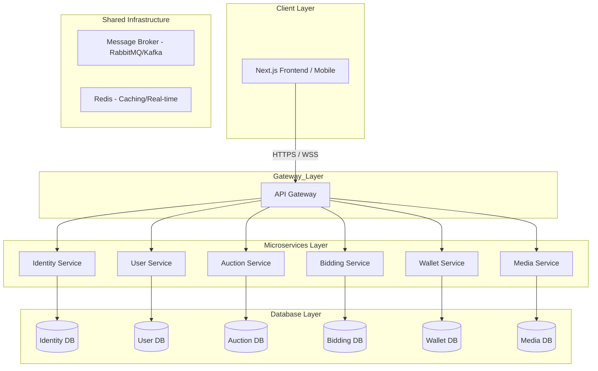

# Architecture Overview - BidNow

## Tech Stack

### Backend

- **Language:** Java 17
- **Framework:** Spring Boot 3.x
- **Microservices Orchestration:** Spring Cloud (Gateway, Service Discovery, Config Server)
- **ORM:** Spring Data JPA / Hibernate
- **Build Tool:** Maven
- **Messaging:** RabbitMQ or Apache Kafka (for inter-service communication)

### Database

- **Primary Database:** PostgreSQL 15+ (Individual database per microservice)
- **Caching:** Redis (Global cache for sessions and real-time bid leaderboards)

### Frontend

- **Framework:** Next.js (TypeScript)
- **Styling:** Tailwind CSS
- **State Management:** Zustand or React Context
- **Real-time:** Socket.io-client or Native WebSockets

### External Services

- **Cloud Storage:** Cloudinary (Product images and user avatars)
- **Email:** SendGrid or AWS SES
- **Payment Gateway:** Stripe or VNPay (Planned for payment phase)

---

## Microservices Architecture

### Core Services

1. **API Gateway**: The entry point for all client requests. Handles routing, rate limiting, and initial security checks.
2. **Identity Service**: Manages user registration (including email OTP verification), login, and JWT token issuance/validation.
3. **User Service**: Manages user profiles, preferences, and account metadata.
4. **Auction Service**: Handles the lifecycle of auction listings (Creation, Active, Closure). Manage "Buy It Now" logic.
5. **Bidding Service**: The high-performance engine for placing bids, calculating auto-bids, and managing the "Anti-sniping" time extensions.
6. **Wallet & Payment Service**: Manages the internal wallet, escrow (deposits), and final transaction processing.
7. **Media Service**: Handles email notifications, templates, media assets, and audit log storage.

---

## Data Flow

### Request Flow

1. **Client** → Request hits the **API Gateway**.
2. **Gateway** → Validates JWT (via Identity Service) and routes to the target microservice.
3. **Microservice** → Executes business logic and persists data to its local **PostgreSQL** instance.
4. **Events** → Service emits an event (e.g., `BID_PLACED`) to the **Message Broker**.
5. **Consumers** → **Media Service** picks up the event and broadcasts it via **WebSocket**.

### Real-time Communication

- **WebSockets**: Used for live price updates on auction pages and "Outbid" alerts.
- **Message Broker**: Ensures eventual consistency between services (e.g., Auction closed → Notification sent → Wallet refund initiated).

---

## High-Level Diagram

---

## Deployment Architecture

- **Frontend:** Vercel (Optimized for Next.js).
- **Backend:** Containerized (Docker) and managed via Kubernetes or AWS ECS.
- **Database:** Managed PostgreSQL (e.g., AWS RDS or Supabase).
- **CI/CD:** GitHub Actions for automated testing and deployment.

---

## Key Design Decisions

- **Microservices Choice:** Chosen to isolate the **Bidding Service**, which requires higher scaling and lower latency than the User or Wallet services.
- **PostgreSQL per Service:** Ensures database independence and prevents tight coupling between services.
- **Event-Driven:** Using a Message Broker allows the system to remain responsive under heavy load by processing non-critical tasks (like emails) asynchronously.

---

## Performance & Scalability

- **Bidding Performance:** The Bidding Service uses **Redis** to keep the "current highest bid" in memory for lightning-fast validation.
- **Horizontal Scaling:** Each service can be scaled independently. The Notification service can have multiple instances to handle thousands of WebSocket connections.

---

## References

- [Functional Requirements](functional.md)
- [Non-Functional Requirements](non-functional.md)
- [Business Clarifications](business-clarifications.md)
