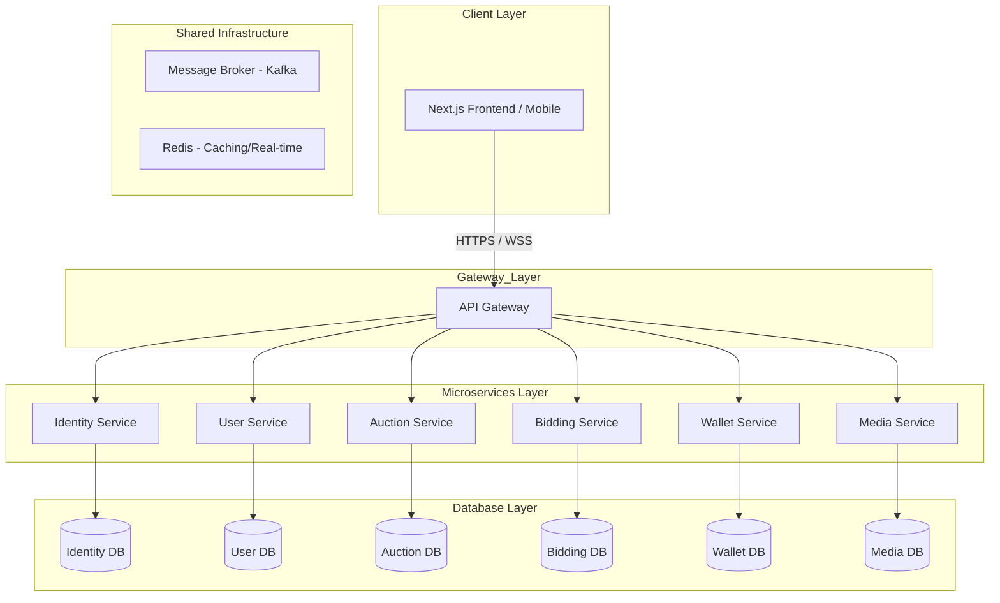

# Architecture Overview - BidNow

## Tech Stack

### Backend

- **Language:** Java 17
- **Framework:** Spring Boot 3.x
- **Microservices Orchestration:** Spring Cloud (Gateway, Service Discovery, Config Server)
- **ORM:** Spring Data JPA / Hibernate
- **Build Tool:** Maven
- **Messaging:** Apache Kafka (for inter-service communication)

### Database

- **Primary Database:** PostgreSQL 15+ (Individual database per microservice)
- **Caching:** Redis (Global cache for sessions and real-time bid leaderboards; also media-service outbid/new-bid batching windows)

### Frontend

- **Framework:** Next.js (TypeScript)
- **Styling:** Tailwind CSS
- **State Management:** Zustand or React Context
- **Real-time:** `@stomp/stompjs` over native WebSocket (STOMP)

### External Services

- **Cloud Storage:** Cloudinary (Product images and user avatars)
- **Email:** SMTP via JavaMail (any SMTP provider; Mailpit in dev)
- **Payment Gateway:** Stripe or VNPay (Planned for payment phase)

---

## Microservices Architecture

### Core Services

1. **API Gateway**: The entry point for all client requests. Handles routing, rate limiting, and initial security checks.
   - Routing is **explicit only**: each service is exposed through the `/api/v1/...` path predicates declared in `api-gateway/src/main/resources/application.yml`. The Spring Cloud Gateway discovery locator (`spring.cloud.gateway.discovery.locator.enabled`) is **disabled**, so `/{service-id}/**` routes (e.g. `/auction-service/actuator/**`) are not reachable through the gateway. New endpoints must be added under an existing or new explicit route. `GatewayRoutesTest` enforces this.
   - `/api/v1/**/internal/**` paths are rejected with `403` by `AuthenticationFilter`; they are only reachable service-to-service (Feign via Eureka).
2. **Identity Service**: Manages user registration (including email OTP verification), login, and JWT token issuance/validation.
3. **User Service**: Manages user profiles, preferences, and account metadata.
4. **Auction Service**: Handles the lifecycle of auction listings (Creation, Active, Closure). Manage "Buy It Now" logic. It is the **source of truth for price**: the internal apply-bid call row-locks the auction, accepts or rejects the bid, and applies the anti-sniping extension in the same transaction.
5. **Bidding Service**: Owns bid placement and bid history. It pre-validates against a Redis-cached auction context, locks the bidder's deposit on their first bid (wallet-service), records the bid and applies it synchronously through auction-service, then publishes `BidPlacedEvent`. Auto-bidding is not implemented yet (Phase 2).
6. **Wallet & Payment Service**: Manages the internal wallet, escrow (deposits), and final transaction processing.
7. **Media Service**: The only notification owner. Kafka handlers turn domain events into idempotent `media_notifications` rows (one per user and dedup key, so a redelivery is a no-op), push each new row live through `user-notification-push-topic` to STOMP `/user/queue/notifications`, and send EN/VI template emails: transactional types (payment emails) ignore the user's email opt-out, every send is logged in `media_email_logs`, and a failed email is not retried. It keeps its own auction/bidder projection (`media_auctions`, `media_auction_participants`) so recipients never need a cross-service call, and batches outbid/new-bid alerts in Redis (5-minute window). It also handles media assets and audit log storage. See [notification-service.schema.md](database/notification-service.schema.md) and the [delivery flow](diagrams/07-notification-delivery-flow.md).

---

## Data Flow

### Request Flow

1. **Client** → Request hits the **API Gateway**.
2. **Gateway** → Validates JWT (via Identity Service) and routes to the target microservice.
3. **Microservice** → Executes business logic and persists data to its local **PostgreSQL** instance.
4. **Events** → Service emits an event (e.g., `BID_PLACED`) to the **Message Broker**.
5. **Consumers** → **Media Service** picks up the event and pushes it over **STOMP** (auction topics, and `user-notification-push-topic` for user notifications).

### Real-time Communication

Real-time auction updates use STOMP over WebSocket (SockJS fallback) served by media-service at `/ws-notifications`, reached through the gateway (`/ws-notifications/**` → `lb://media-service`, auto-upgraded to `ws`). The web frontend connects with `@stomp/stompjs` over the raw WebSocket transport at `/ws-notifications/websocket` (JWT as `access_token`, refreshed on every connect) and re-fetches the auction and first history page on every (re)connect.

- **Public auction topic** `/topic/auctions/{auctionId}` — messages `{type, auctionId, payload}` with `type` ∈ `BID_PLACED` `{bidId, bidderId, bidderName, amount, placedAt, totalBids, endTime, antiSnipingTriggered}`, `AUCTION_EXTENDED` `{previousEndTime, newEndTime, extensionCount}`, `AUCTION_ENDED` `{winnerId, finalPrice, endedAt}`, `AUCTION_CANCELLED` `{reason}`. Anonymous viewers may subscribe.
- **Private queue** `/user/queue/notifications` — `{type, notification, unreadCount}` with `type` = `NOTIFICATION` (a newly stored inbox notification; `unreadCount` counted after commit); outbid (`BID_OUTBID`, previous leader) and seller new-bid (`NEW_BID`) alerts are stored notifications batched per user and auction: the first in a quiet 5-minute window is sent immediately, later ones are summed into one notification when the window closes (state in media-service's Redis, `notification.outbid.batch-window-seconds`). Requires an identified session. Pushes fan out through `user-notification-push-topic` (per-instance consumer groups) so they reach whichever instance holds the socket. The frontend consumes it from one root-level connection (`useUserNotifications`); the auction page's socket subscribes only to its auction topic. `NotificationResponse.createdAt` is ISO-8601 with the server zone's offset.
- **Inbox REST** `/api/v1/notifications` (media-service, via the gateway): list (paging ≤ 100, filters read/types/from/to/search), `unread-count`, get (marks read), `{id}/read`, `{id}/unread`, `mark-all-read`, delete `{id}` / `delete-all` / `delete-read` (soft delete). Scoped to the caller; another user's id is 404.
- **Auth:** the gateway treats `/ws-notifications/**` as optional-auth: it strips client `X-User-Id`/`X-User-Roles`, accepts a JWT via `Authorization: Bearer` or `?access_token=` (browsers cannot set WebSocket headers), injects `X-User-Id` when valid (401 when invalid), and never forwards `access_token`. media-service names the STOMP session after `X-User-Id` (`GatewayUserHandshakeHandler`).
- **Gateway hardening:** internal paths are also blocked under service-name prefixes (`/{service}/api/v1/**/internal/**`) as defense in depth, although the discovery locator that created those routes is now disabled, and identity headers (`X-User-Id`/`X-User-Roles`) are stripped on public paths. On the optional-auth path the gateway rejects `;` and `..` segments and encoded slashes/dots with 400, returns 400 (not 500) for malformed queries, and strips `access_token` even when URL-encoded. The global `DedupeResponseHeader` default filter keeps a single `Access-Control-Allow-Origin` (gateway CORS + SockJS both set it).
- **Receive-only clients:** an inbound STOMP guard rejects every client command except CONNECT/SUBSCRIBE/UNSUBSCRIBE/DISCONNECT/ACK/NACK, and allows SUBSCRIBE only to `/topic/auctions/{uuid}` and, for identified sessions, `/user/queue/notifications`.
- **Scaling:** SockJS HTTP-fallback transports need session affinity when media-service runs more than one instance (not configured yet); iframe transports are unsupported (X-Frame-Options DENY).
- **Fan-out:** media-service consumes `bid-placed-topic`, `auction-extended-topic`, `auction-ended-topic`, `auction-cancelled-topic` with per-instance consumer groups (one per listener per instance; `media-realtime-<uuid>`, latest offsets) so every instance pushes to its own clients. Delivery is best-effort; clients resync via REST on reload.

### Service-to-Service Internal APIs

Synchronous internal calls go directly between services via Eureka + OpenFeign, never through the API Gateway. The gateway's `AuthenticationFilter` blocks `/api/v1/**/internal/**` and `/*/api/v1/**/internal/**` (service-name-prefixed discovery routes), and each owning service `permitAll`s its own internal paths.

| Owner | Endpoint | Caller | Purpose |
|---|---|---|---|
| Auction | `GET /api/v1/internal/auctions/{id}/bid-context` | Bidding | Price, increment, deposit, status, seller, winner, total bids and end time for bid pre-validation. Errors: `AUCTION_NOT_FOUND` 404 |
| Auction | `POST /api/v1/internal/auctions/{id}/bids` `{bidId, bidderId, amount}` | Bidding | Authoritative, row-locked bid application (`SELECT … FOR UPDATE`, serialized with closure/cancel). Idempotent on `bidId`. First bid ≥ current price, later bids ≥ current price + increment. Anti-sniping: a bid with < 120 s left extends end_time by 300 s (auction.anti-snipe.*), recorded in auction_extensions; response extended=true. Closure jobs are keyed on (auctionId, end_time) and fire at end_time + `auction.closure.grace-seconds` (20 s), because JobRunr enqueues scheduled jobs up to one poll interval early; a job finding the auction extended reschedules for the new end time. Errors: `BID_TOO_LOW` 400 (`errors.minimumBid`), `BID_OWN_AUCTION` 403, `AUCTION_NOT_FOUND` 404, `AUCTION_NOT_OPEN` 409 |
| Wallet | `GET /api/v1/internal/wallet/deposit-lock?userId=&auctionId=` | Bidding | Is the user's deposit locked for this auction? |
| Wallet | `POST /api/v1/internal/wallet/deposit-lock` `{userId, auctionId, depositAmount}` | Bidding | Idempotently lock the deposit on first bid (implicit registration). Errors: `INSUFFICIENT_BALANCE` 400, `WALLET_NOT_ACTIVE` 403, `WALLET_NOT_FOUND` 404, `DEPOSIT_LOCK_CLOSED` 409 |
| Wallet | `GET /api/v1/internal/wallet/balance/{userId}` | Bidding | Total / available / locked balances |
| User | `POST /api/v1/users/internal/summaries` `{userIds: [≤100]}` | Bidding | Batch display name + avatar for bid history (one query; unknown ids omitted) |

### Bidding Service (public API & events)

| Endpoint | Auth | Purpose |
|---|---|---|
| `POST /api/v1/bids` `{auctionId, amount}` | `X-User-Id` | Place a bid: pre-validate (cached context, refreshed once on 409) → lock deposit on first bid (wallet) → insert bid + apply atomically (auction, row-locked) → 201 `PlaceBidResponse`. Errors: `BID_TOO_LOW` 400 (`errors.minimumBid`), `BID_OWN_AUCTION` / `BID_INSUFFICIENT_BALANCE` (`errors.availableBalance`, `errors.required`) / `WALLET_NOT_ACTIVE` / `WALLET_NOT_FOUND` 403, `AUCTION_NOT_FOUND` 404, `AUCTION_NOT_OPEN` / `DEPOSIT_LOCK_CLOSED` 409, `SERVICE_UNAVAILABLE` 503 |
| `GET /api/v1/bids/auction/{auctionId}?page=&size=` | public (gateway + service) | Bid history, newest first, `size` ≤ 100; bidder names batch-resolved (fallback "Unknown bidder") |
| `GET /api/v1/bids/auction/{auctionId}/my-bids?page=&size=` | `X-User-Id` | The caller's bids on the auction |

| Topic | Direction | Payload / effect |
|---|---|---|
| `bid-placed-topic` | publishes (after commit, key = auctionId) | `BidPlacedEvent` incl. `bidId`, `totalBids`, `endTime`, `previousHighestBidderId` |
| `auction-ended-topic`, `auction-cancelled-topic`, `auction-extended-topic` | consumes (`bidding-service-group`) | Evict `bidding:auction:{id}:context` |
| `auction-extended-topic` | published by auction-service (after commit, key = auctionId) | `AuctionExtendedEvent {auctionId, auctionTitle, previousEndTime, newEndTime, extensionCount, triggeredByBidId, triggeredByUserId}` |
| `auction-ending-soon-topic` | published by auction-service (after commit, key = auctionId) | `AuctionEndingSoonEvent {auctionId, auctionTitle, sellerId, endTime, thresholdMinutes}` — one per configured threshold (`auction.ending-soon.thresholds-minutes`, default 60 and 15) before the current end time; JobRunr jobs reschedule themselves after anti-sniping extensions. media-service turns it into an in-app `AUCTION_ENDING_SOON` for every bidder. |

### Wallet Events (Kafka)

| Direction | Topic | Payload | Purpose |
|---|---|---|---|
| Consumes | `auction-ended-topic` | `AuctionEndedEvent` | Refund every `LOCKED` deposit for the auction except the winner's (`AUCTION_LOST`). Losers are derived from `deposit_locks`; `loserIds` is not used. |
| Consumes | `auction-cancelled-topic` | `AuctionCancelledEvent` | Refund every `LOCKED` deposit for the auction (`AUCTION_CANCELLED`). |
| Produces | `deposit-refunded-topic` (key `userId`) | `DepositRefundedEvent { userId, walletId, auctionId, amount, reason, refundedAt }` | One per non-zero refund, published after commit. |
| Consumes | `auction-ended-topic` (winner) | `AuctionEndedEvent` | Create a 48h payment hold for the winner (`payment_holds`); deposit counts toward the price. |
| Consumes | `auction-cancelled-topic` (hold) | `AuctionCancelledEvent` | Void any `PENDING_PAYMENT` hold and return held funds. |
| Produces | `payment-event-topic` (key winner `userId`) | `PaymentEvent { paymentType: REQUIRED \| REMINDER_24H \| COMPLETED \| FAILED, … }` | Payment required (with deadline, `insufficientFunds`) / payment reminder #2 (once per hold, sent by the 5-minute reminder scheduler when 24 h are left; same fields as REQUIRED; tracked by `payment_holds.reminder_sent_at`) / payment completed / payment failed (deposit forfeited by the 5-minute forfeit scheduler); after commit. Field meanings differ by type: `depositAmount` is the deposit applied for REQUIRED/REMINDER_24H/COMPLETED but the amount forfeited for FAILED; `remaining` is still owed for REQUIRED/REMINDER_24H, paid from balance for COMPLETED, and returned to the winner for FAILED. |

Each refund is its own DB transaction. The retry/DLT policy applies to **all** wallet-service listeners (including `user-registered-topic`): failed records are retried 3 times with exponential backoff (1s, 2s, 4s), then published to `<topic>.DLT` on the same partition number — so a `.DLT` topic must have at least as many partitions as its source topic (auto-created topics use the broker default, currently 3). Redelivery and DLT replay of processing failures are safe because released locks are skipped. Undeserializable records go straight to `<topic>.DLT` via `ErrorHandlingDeserializer`; their payload is the raw bytes re-encoded as a base64 JSON string, so they need manual decoding and cannot be replayed as-is.

**Winner payment endpoints (public, via gateway):** `GET /api/v1/wallets/payments/pending`, `POST /api/v1/wallets/payments/confirm { auctionId }`. Confirm settles atomically: hold row locked first, then winner and seller wallets in ascending id order.

**Wallet admin API (ADMIN role, via gateway `/api/v1/admin/wallets/**`):**

| Method | Path | Purpose |
|---|---|---|
| GET | `/api/v1/admin/wallets/stats` | Platform wallet balance, active wallets, total locked, active deposit locks |
| GET | `/api/v1/admin/wallets/transactions?type&page=0&size=50` | All transactions, newest first |
| GET | `/api/v1/admin/wallets/{userId}` | Wallet, last 20 transactions, active deposit locks |
| POST | `/api/v1/admin/wallets/{userId}/freeze` · `/unfreeze` | Status SUSPENDED / ACTIVE |
| POST | `/api/v1/admin/wallets/transactions/{id}/refund` `{ reason }` | Refund a user-side PAYMENT/FORFEIT once, funded by the platform wallet |

Admin actions are audited (`@Audit` → `audit-events` topic).

### Notification Events (Kafka)

media-service is the only notification owner. Domain events are consumed in the shared `media-service-group` (default offset `earliest`); live pushes use per-instance groups. Source of truth for group names: `NotificationKafkaConsumer`, `AuctionProjectionConsumer`, `UserNotificationPushConsumer`.

| Topic | Producer | Consumer group(s) | Purpose |
|---|---|---|---|
| `user-registered-topic` | identity-service | `media-service-group` | Welcome notification and email |
| `auction-created-topic` | auction-service | `media-service-group`; `media-projection-group` | Seller notification and email; projection upsert |
| `auction-ended-topic` | auction-service | `media-service-group` | Won (winner), lost (other bidders), unsold (seller) |
| `auction-cancelled-topic` | auction-service | `media-service-group` | Cancellation to bidders and seller |
| `auction-extended-topic` | auction-service | `media-service-group`; `media-projection-group` | Anti-sniping extension to bidders and seller; projection `end_time` update |
| `bid-placed-topic` | bidding-service | `media-service-group`; `media-projection-group` | First-bid, outbid and new-bid alerts (Redis batching); projection title and participant upsert |
| `payment-event-topic` | wallet-service | `media-service-group` | Payment required, reminder #2, completed and failed |
| `deposit-refunded-topic` | wallet-service | `media-service-group` | Deposit refunded notification (email only after a loss) |
| `auction-ending-soon-topic` | auction-service (JobRunr jobs, 60 and 15 min before the current end) | `media-service-group` | In-app "ending soon" for bidders |
| `user-verification-requested-topic` | identity-service | `media-service-group` | OTP verification email (no in-app row) |
| `user-notification-push-topic` | media-service (after commit, key `userId`) | per-instance `media-push-<uuid>`, latest offsets | Push `{type: NOTIFICATION, notification, unreadCount}` to `/user/queue/notifications` on the instance holding the socket |

`media-realtime-<uuid>` (`AuctionRealtimeConsumer`, per instance) carries auction-topic broadcasts, not notifications, while `media-push-<uuid>` carries notification pushes.

`media-projection-group` is a separate stable group because sharing `media-service-group` on the same topics would split partitions between the notification handlers and the projection.

Scheduled sources stay in their own domain and emit events: wallet `PaymentReminderScheduler` (every 5 min, emits `REMINDER_24H`), wallet `ForfeitScheduler` (emits `FAILED`), and the auction ending-soon jobs (`auction-ending-soon-topic`).

---

## High-Level Diagram

```mermaid
graph TD
    %% Layers Definition
    subgraph Client_Layer [Client Layer]
        Client[Next.js Frontend / Mobile]
    end

    subgraph Gateway_Layer
        Gateway[API Gateway]
    end

    subgraph Microservices_Layer [Microservices Layer]
        Identity[Identity Service]
        User[User Service]
        Auction[Auction Service]
        Bidding[Bidding Service]
        Wallet[Wallet Service]
        Notify[Media Service]
    end

    subgraph Infrastructure [Shared Infrastructure]
        Broker[Message Broker - Kafka]
        Cache[Redis - Caching/Real-time]
    end

    subgraph Database_Layer [Database Layer]
        DB_ID[(Identity DB)]
        DB_User[(User DB)]
        DB_Auc[(Auction DB)]
        DB_Bid[(Bidding DB)]
        DB_Wal[(Wallet DB)]
        DB_Not[(Media DB)]
    end

    %% Connections
    Client -->|HTTPS / WSS| Gateway

    Gateway --> Identity
    Gateway --> User
    Gateway --> Auction
    Gateway --> Bidding
    Gateway --> Wallet
    Gateway --> Notify

    %% Service to DB mappings
    Identity --> DB_ID
    User --> DB_User
    Auction --> DB_Auc
    Bidding --> DB_Bid
    Wallet --> DB_Wal
    Notify --> DB_Not
```

---

## Deployment Architecture

- **Frontend:** Vercel (Optimized for Next.js).
- **Backend:** Containerized (Docker) and managed via Kubernetes or AWS ECS.
- **Database:** Managed PostgreSQL (e.g., AWS RDS or Supabase).
- **CI/CD:** GitHub Actions for automated testing and deployment.

---

## Key Design Decisions

- **Microservices Choice:** Chosen to isolate the **Bidding Service**, which requires higher scaling and lower latency than the User or Wallet services.
- **PostgreSQL per Service:** Ensures database independence and prevents tight coupling between services.
- **Event-Driven:** Using a Message Broker allows the system to remain responsive under heavy load by processing non-critical tasks (like emails) asynchronously.

---

## Performance & Scalability

- **Bidding Performance:** The Bidding Service caches each auction's bid context in **Redis** for fast pre-validation (rejecting obviously low bids without a round-trip); the authoritative check is auction-service's row-locked apply-bid, so concurrent bids and closure can never both win.
- **Horizontal Scaling:** Each service can be scaled independently. media-service can have multiple instances to handle thousands of STOMP connections.

---

## References

- [Functional Requirements](functional.md)
- [Non-Functional Requirements](non-functional.md)
- [Business Clarifications](business-clarifications.md)
- [Notification schema](database/notification-service.schema.md)
- [Notification delivery flow](diagrams/07-notification-delivery-flow.md)
- [Notification epic roadmap](superpowers/plans/2026-09-30-notification-epic-roadmap.md)
