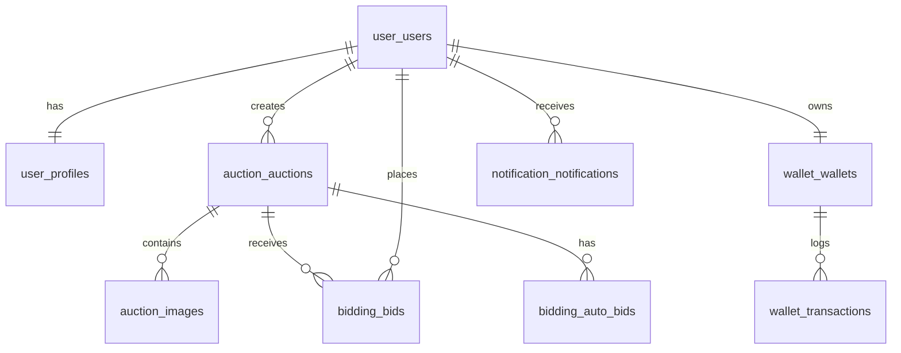

# Database Schema - BidNow

This document describes the database schema for the BidNow auction system. Following the microservices architecture, each service owns its own database/schema. Table names are prefixed by service initials for clarity.

---

## 1. Identity & User Services
**Purpose:** Manages authentication (Identity) and user profiles (User).

### identity_users
| Column | Type | Constraints | Description |
| :--- | :--- | :--- | :--- |
| id | UUID | PRIMARY KEY | Unique user identifier |
| email | VARCHAR(255) | UNIQUE, NOT NULL | User's email (login) |
| password_hash | VARCHAR(255) | NOT NULL | Hashed password |
| is_email_verified| BOOLEAN | DEFAULT FALSE | Email verification status |
| verification_otp| VARCHAR(6) | | 6-digit OTP for email verification |
| otp_expires_at | TIMESTAMP | | Expiration time for OTP |
| is_active | BOOLEAN | DEFAULT TRUE | Account active status |
| created_at | TIMESTAMP | DEFAULT NOW() | Account creation time |
| updated_at | TIMESTAMP | DEFAULT NOW() | Last update time |

### user_profiles
| Column | Type | Constraints | Description |
| :--- | :--- | :--- | :--- |
| user_id | UUID | PK, FK -> user_users(id) | Reference to user account |
| display_name | VARCHAR(100) | NOT NULL | Publicly visible name |
| avatar_url | VARCHAR(512) | | Link to Cloudinary image |
| bio | TEXT | | Short user biography |

---

## 2. Auction Service (`auction_`)
**Purpose:** Manages item listings and auction lifecycles.

### auction_auctions
| Column | Type | Constraints | Description |
| :--- | :--- | :--- | :--- |
| id | UUID | PRIMARY KEY | Unique auction identifier |
| seller_id | UUID | NOT NULL | User ID of the seller (Logical FK) |
| title | VARCHAR(255) | NOT NULL | Item title |
| description | TEXT | | Detailed item description |
| category_id | BIGINT | | Reference to category |
| start_price | DECIMAL(19,4) | NOT NULL | Initial bidding price |
| reserve_price| DECIMAL(19,4) | | Minimum price to sell (optional) |
| bin_price | DECIMAL(19,4) | | Buy It Now price |
| bid_increment| DECIMAL(19,4) | DEFAULT 0 | Minimum amount to increase bid |
| start_at | TIMESTAMP | NOT NULL | When bidding begins |
| end_at | TIMESTAMP | NOT NULL | When bidding ends |
| status | VARCHAR(20) | NOT NULL | DRAFT, ACTIVE, ENDED, CLOSED |

### auction_categories
| Column | Type | Constraints | Description |
| :--- | :--- | :--- | :--- |
| id | BIGINT | PRIMARY KEY | |
| name | VARCHAR(100) | UNIQUE, NOT NULL| |
| parent_id | BIGINT | FK -> self(id) | For sub-categories |

### auction_images
| Column | Type | Constraints | Description |
| :--- | :--- | :--- | :--- |
| id | UUID | PRIMARY KEY | |
| auction_id | UUID | FK -> auction_auctions(id)| |
| url | VARCHAR(512) | NOT NULL | Cloudinary image URL |
| sort_order | SMALLINT | DEFAULT 0 | Ordering of images |

---

## 3. Bidding Service (`bidding_`)
**Purpose:** High-performance engine for handling bids.

### bidding_bids
| Column | Type | Constraints | Description |
| :--- | :--- | :--- | :--- |
| id | UUID | PRIMARY KEY | |
| auction_id | UUID | NOT NULL | Logical FK |
| bidder_id | UUID | NOT NULL | Logical FK |
| amount | DECIMAL(19,4) | NOT NULL | Amount bid |
| created_at | TIMESTAMP | DEFAULT NOW() | Bidding timestamp |

### bidding_auto_bids
| Column | Type | Constraints | Description |
| :--- | :--- | :--- | :--- |
| id | UUID | PRIMARY KEY | |
| auction_id | UUID | NOT NULL | |
| bidder_id | UUID | NOT NULL | |
| max_amount | DECIMAL(19,4) | NOT NULL | Max limit for auto-bidding |
| status | VARCHAR(20) | NOT NULL | ACTIVE, EXCEEDED, CANCELLED |

---

## 4. Wallet Service (`wallet_`)
**Purpose:** Financial ledger and deposit management.

### wallet_wallets
| Column | Type | Constraints | Description |
| :--- | :--- | :--- | :--- |
| id | UUID | PRIMARY KEY | |
| user_id | UUID | UNIQUE, NOT NULL | Logical FK |
| balance | DECIMAL(19,4) | DEFAULT 0 | Available funds |
| version | BIGINT | NOT NULL | For optimistic locking |

### wallet_transactions
| Column | Type | Constraints | Description |
| :--- | :--- | :--- | :--- |
| id | UUID | PRIMARY KEY | |
| wallet_id | UUID | FK -> wallet_wallets(id) | |
| amount | DECIMAL(19,4) | NOT NULL | Positive (plus) or Negative (minus) |
| type | VARCHAR(20) | NOT NULL | DEPOSIT, WITHDRAW, HOLD, REFUND |
| ref_type | VARCHAR(20) | | AUCTION, ORDER, SYSTEM |
| ref_id | UUID | | Logical FK to related entity |
| status | VARCHAR(20) | NOT NULL | SUCCESS, PENDING, FAILED |
| created_at | TIMESTAMP | DEFAULT NOW() | |

### wallet_deposits
| Column | Type | Constraints | Description |
| :--- | :--- | :--- | :--- |
| id | UUID | PRIMARY KEY | |
| auction_id | UUID | NOT NULL | |
| bidder_id | UUID | NOT NULL | |
| amount | DECIMAL(19,4) | NOT NULL | Amount being held |
| status | VARCHAR(20) | NOT NULL | HELD, REFUNDED, FORFEITED |

---

## 5. Notification Service (`notification_`)
**Purpose:** History of user notifications.

### notification_notifications
| Column | Type | Constraints | Description |
| :--- | :--- | :--- | :--- |
| id | UUID | PRIMARY KEY | |
| user_id | UUID | NOT NULL | Logical FK |
| title | VARCHAR(255) | NOT NULL | |
| content | TEXT | | |
| type | VARCHAR(50) | | BID_OUTBID, AUCTION_WON, etc. |
| is_read | BOOLEAN | DEFAULT FALSE | |
| created_at | TIMESTAMP | DEFAULT NOW() | |

---

## Logical Relationships (Cross-Service)

Due to the Microservices architecture, **hard Foreign Key constraints** are only used within a single service's database. Cross-service relationships are **logical references** (shared IDs):

- **Users (user_) <-> Auctions (auction_)**: `auction_auctions.seller_id` references `user_users.id`.
- **Auctions (auction_) <-> Bids (bidding_)**: `bidding_bids.auction_id` references `auction_auctions.id`.
- **Users (user_) <-> Wallet (wallet_)**: `wallet_wallets.user_id` references `user_users.id`.

Consistency between these services is maintained via **Domain Events** (e.g., `AuctionEndedEvent` triggers `RefundDeposits` in Wallet Service).

---

## Entity Relationship Diagram (Logical)

---

## Indexes & Performance
- **bidding_bids**: Composite index `(auction_id, amount DESC)` for quick retrieval of current highest bid.
- **auction_auctions**: Index on `end_at` for the auction-closing scheduler.
- **user_users**: Unique index on `email`.

---

## Data Retention
- `wallet_transactions` and `bidding_bids` are permanent for audit purposes.
- `notification_notifications` may be archived after 90 days of "read" status.
