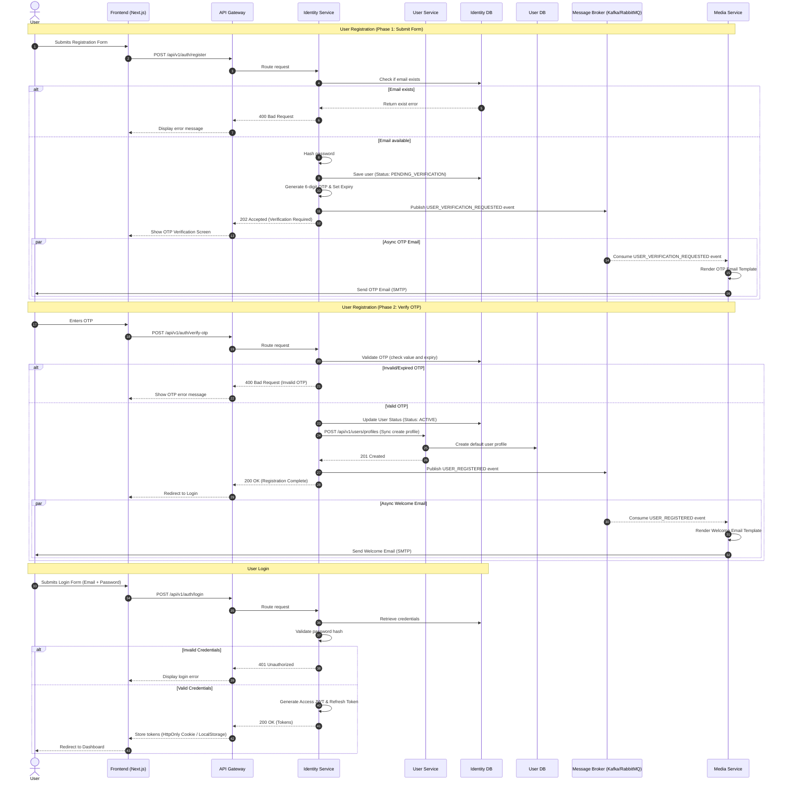

# User Registration & Authentication Flow

```mermaid
sequenceDiagram
    autonumber
    actor User
    participant App as Frontend (Next.js)
    participant GW as API Gateway
    participant ID as Identity Service
    participant US as User Service
    participant DB_ID as Identity DB
    participant DB_US as User DB
    participant MQ as Message Broker (Kafka/RabbitMQ)
    participant NS as Media Service

    %% Registration Flow
    Note over User, NS: User Registration (Phase 1: Submit Form)
    User->>App: Submits Registration Form
    App->>GW: POST /api/v1/auth/register
    GW->>ID: Route request
    ID->>DB_ID: Check if email exists
    alt Email exists
        DB_ID-->>ID: Return exist error
        ID-->>GW: 400 Bad Request
        GW-->>App: Display error message
    else Email available
        ID->>ID: Hash password
        ID->>DB_ID: Save user (Status: PENDING_VERIFICATION)
        ID->>ID: Generate 6-digit OTP & Set Expiry
        ID->>MQ: Publish USER_VERIFICATION_REQUESTED event
        ID-->>GW: 202 Accepted (Verification Required)
        GW-->>App: Show OTP Verification Screen

        %% Async OTP Email
        par Async OTP Email
            MQ-->>NS: Consume USER_VERIFICATION_REQUESTED event
            NS->>NS: Render OTP Email Template
            NS->>User: Send OTP Email (SMTP)
        end
    end

    Note over User, NS: User Registration (Phase 2: Verify OTP)
    User->>App: Enters OTP
    App->>GW: POST /api/v1/auth/verify-otp
    GW->>ID: Route request
    ID->>DB_ID: Validate OTP (check value and expiry)
    alt Invalid/Expired OTP
        ID-->>GW: 400 Bad Request (Invalid OTP)
        GW-->>App: Show OTP error message
    else Valid OTP
        ID->>DB_ID: Update User Status (Status: ACTIVE)
        ID->>US: POST /api/v1/users/profiles (Sync create profile)
        US->>DB_US: Create default user profile
        US-->>ID: 201 Created
        ID->>MQ: Publish USER_REGISTERED event
        ID-->>GW: 200 OK (Registration Complete)
        GW-->>App: Redirect to Login
        
        %% Async Welcome Email
        par Async Welcome Email
            MQ-->>NS: Consume USER_REGISTERED event
            NS->>NS: Render Welcome Email Template
            NS->>User: Send Welcome Email (SMTP)
        end
    end

    %% Login Flow
    Note over User, DB_ID: User Login
    User->>App: Submits Login Form (Email + Password)
    App->>GW: POST /api/v1/auth/login
    GW->>ID: Route request
    ID->>DB_ID: Retrieve credentials
    ID->>ID: Validate password hash
    alt Invalid Credentials
        ID-->>GW: 401 Unauthorized
        GW-->>App: Display login error
    else Valid Credentials
        ID->>ID: Generate Access JWT & Refresh Token
        ID-->>GW: 200 OK (Tokens)
        GW-->>App: Store tokens (HttpOnly Cookie / LocalStorage)
        App-->>User: Redirect to Dashboard
    end
```
