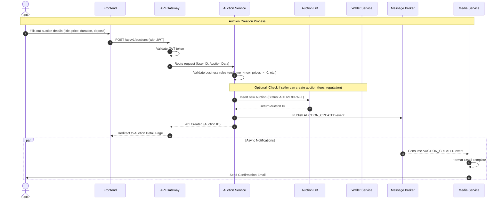

# Auction Creation Flow

```mermaid
sequenceDiagram
    autonumber
    actor Seller
    participant App as Frontend
    participant GW as API Gateway
    participant AS as Auction Service
    participant DB_AS as Auction DB
    participant WS as Wallet Service
    participant MQ as Message Broker
    participant NS as Media Service

    Note over Seller, NS: Auction Creation Process
    
    Seller->>App: Fills out auction details (title, price, duration, deposit)
    App->>GW: POST /api/v1/auctions (with JWT)
    GW->>GW: Validate JWT token
    GW->>AS: Route request (User ID, Auction Data)
    
    %% Validation Phase
    AS->>AS: Validate business rules (end time > now, prices >= 0, etc.)
    
    %% If seller needs to have sufficient balance or fee (optional based on future rules)
    Note over AS, WS: Optional: Check if seller can create auction (fees, reputation)
    
    %% Saving Phase
    AS->>DB_AS: Insert new Auction (Status: ACTIVE/DRAFT)
    DB_AS-->>AS: Return Auction ID
    
    AS->>MQ: Publish AUCTION_CREATED event
    AS-->>GW: 201 Created (Auction ID)
    GW-->>App: Redirect to Auction Detail Page
    
    %% Async Notifications
    par Async Notifications
        MQ-->>NS: Consume AUCTION_CREATED event
        NS->>NS: Format Email Template
        NS->>Seller: Send Confirmation Email
    end
```
