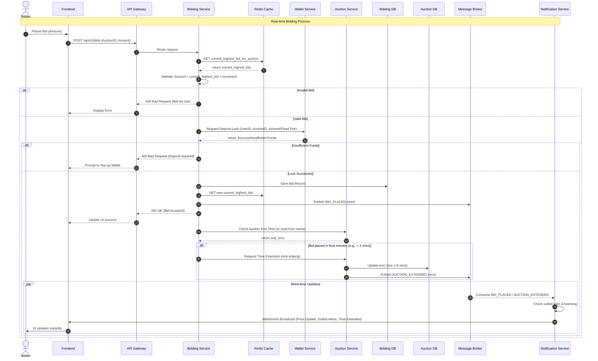

# Bidding & Anti-sniping Flow

```mermaid
sequenceDiagram
    autonumber
    actor Bidder
    participant App as Frontend
    participant GW as API Gateway
    participant BS as Bidding Service
    participant Redis as Redis Cache
    participant WS as Wallet Service
    participant AS as Auction Service
    participant DB_BS as Bidding DB
    participant DB_AS as Auction DB
    participant MQ as Message Broker
    participant NS as Notification Service

    Note over Bidder, NS: Real-time Bidding Process
    
    Bidder->>App: Places Bid (Amount)
    App->>GW: POST /api/v1/bids (AuctionID, Amount)
    GW->>BS: Route request
    
    %% Fast validation via Redis
    BS->>Redis: GET current_highest_bid_for_auction
    Redis-->>BS: return current_highest_bid
    BS->>BS: Validate: Amount > current_highest_bid + increment
    
    alt Invalid Bid
        BS-->>GW: 400 Bad Request (Bid too low)
        GW-->>App: Display Error
    else Valid Bid
        %% Deposit Lock
        BS->>WS: Request Deposit Lock (UserID, AuctionID, Amount/Fixed Fee)
        WS-->>BS: return Success/Insufficient Funds
        
        alt Insufficient Funds
            BS-->>GW: 400 Bad Request (Deposit required)
            GW-->>App: Prompt to Top-up Wallet
        else Lock Successful
            %% Accept Bid
            BS->>DB_BS: Save Bid Record
            BS->>Redis: SET new current_highest_bid
            BS->>MQ: Publish BID_PLACED event
            BS-->>GW: 200 OK (Bid Accepted)
            GW-->>App: Update UI success
            
            %% Anti-Sniping Check
            BS->>AS: Check Auction End Time (or read from cache)
            AS-->>BS: return end_time
            
            alt Bid placed in final minutes (e.g., < 2 mins)
                BS->>AS: Request Time Extension (Anti-sniping)
                AS->>DB_AS: Update end_time (+5 mins)
                AS->>MQ: Publish AUCTION_EXTENDED event
            end
            
            %% Async Notifications
            par Real-time Updates
                MQ-->>NS: Consume BID_PLACED / AUCTION_EXTENDED
                NS->>NS: Check outbid logic & batching
                NS->>App: WebSocket Broadcast (Price Update, Outbid Alerts, Time Extended)
                App->>Bidder: UI updates instantly
            end
        end
    end
```
