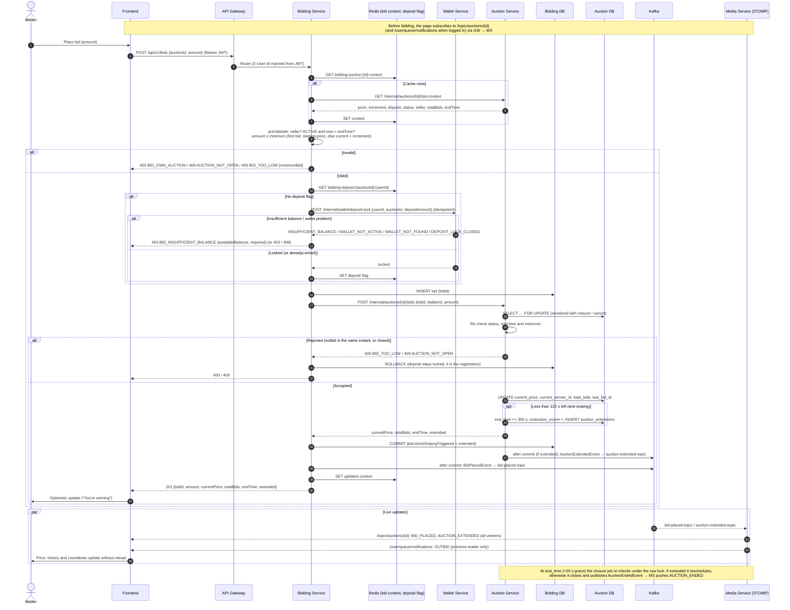

# Bidding & Anti-sniping Flow

Source of truth: `docs/superpowers/specs/2026-07-04-bidding-service-design.md` §3 (placement) and §6 (real-time).
auction-service owns price and end time: the bid and any anti-sniping extension are applied in one row-locked transaction.

**Failure handling (spec §7):** wallet or auction-service timeouts return `503 SERVICE_UNAVAILABLE`. If the local commit fails after a successful apply-bid, bidding-service logs `CRITICAL` with the `bidId` (auction-service keeps `last_bid_id` for reconciliation). Kafka publishing happens after commit and never blocks the bid; browsers recover missed pushes by re-fetching on reconnect or reload.
