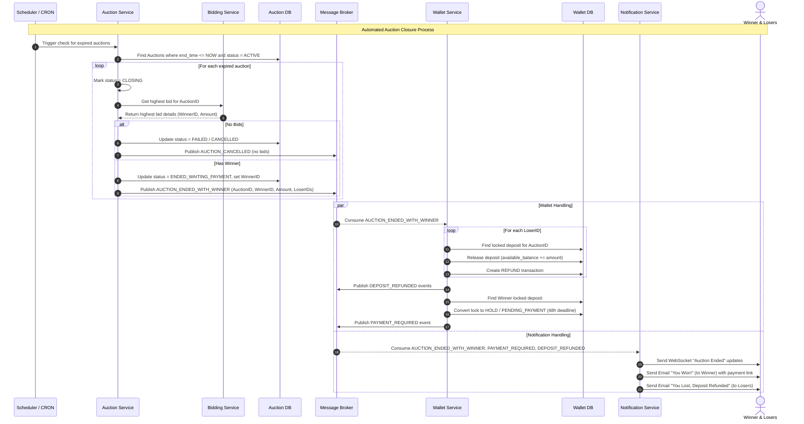

# Auction Closure & Winner Selection Flow

```mermaid
sequenceDiagram
    autonumber
    participant Job as Scheduler / CRON
    participant AS as Auction Service
    participant BS as Bidding Service
    participant DB_AS as Auction DB
    participant MQ as Message Broker
    participant WS as Wallet Service
    participant DB_WS as Wallet DB
    participant NS as Notification Service
    actor Users as Winner & Losers

    Note over Job, Users: Automated Auction Closure Process
    
    Job->>AS: Trigger check for expired auctions
    AS->>DB_AS: Find Auctions where end_time <= NOW and status = ACTIVE
    
    loop For each expired auction
        AS->>AS: Mark status = CLOSING
        
        %% Get Winner
        AS->>BS: Get highest bid for AuctionID
        BS-->>AS: Return highest bid details (WinnerID, Amount)
        
        alt No Bids
            AS->>DB_AS: Update status = FAILED / CANCELLED
            AS->>MQ: Publish AUCTION_CANCELLED (no bids)
        else Has Winner
            AS->>DB_AS: Update status = ENDED_WAITING_PAYMENT, set WinnerID
            AS->>MQ: Publish AUCTION_ENDED_WITH_WINNER (AuctionID, WinnerID, Amount, LoserIDs)
        end
    end
    
    %% Post-closure Async Processes
    par Wallet Handling
        MQ-->>WS: Consume AUCTION_ENDED_WITH_WINNER
        loop For each LoserID
            WS->>DB_WS: Find locked deposit for AuctionID
            WS->>DB_WS: Release deposit (available_balance += amount)
            WS->>DB_WS: Create REFUND transaction
        end
        WS->>MQ: Publish DEPOSIT_REFUNDED events
        
        WS->>DB_WS: Find Winner locked deposit
        WS->>DB_WS: Convert lock to HOLD / PENDING_PAYMENT (48h deadline)
        WS->>MQ: Publish PAYMENT_REQUIRED event
        
    and Notification Handling
        MQ-->>NS: Consume AUCTION_ENDED_WITH_WINNER, PAYMENT_REQUIRED, DEPOSIT_REFUNDED
        NS->>Users: Send WebSocket "Auction Ended" updates
        NS->>Users: Send Email "You Won!" (to Winner) with payment link
        NS->>Users: Send Email "You Lost, Deposit Refunded" (to Losers)
    end
```
