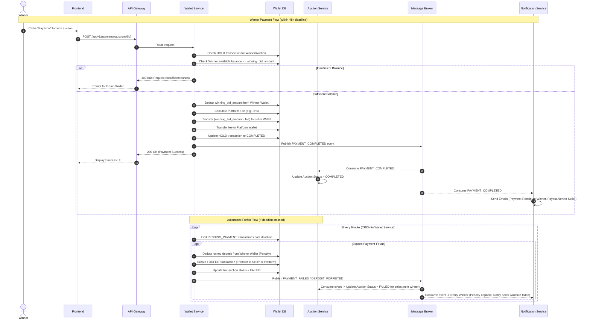

# Winner Payment & Forfeit Flow

```mermaid
sequenceDiagram
    autonumber
    actor Winner
    participant App as Frontend
    participant GW as API Gateway
    participant WS as Wallet Service
    participant DB_WS as Wallet DB
    participant AS as Auction Service
    participant MQ as Message Broker
    participant NS as Notification Service

    Note over Winner, NS: Winner Payment Flow (within 48h deadline)
    
    Winner->>App: Clicks "Pay Now" for won auction
    App->>GW: POST /api/v1/payments/auctions/{id}
    GW->>WS: Route request
    
    WS->>DB_WS: Check HOLD transaction for Winner/Auction
    WS->>DB_WS: Check Winner available balance >= winning_bid_amount
    
    alt Insufficient Balance
        WS-->>GW: 400 Bad Request (Insufficient funds)
        GW-->>App: Prompt to Top-up Wallet
    else Sufficient Balance
        %% Process Payment
        WS->>DB_WS: Deduct winning_bid_amount from Winner Wallet
        WS->>DB_WS: Calculate Platform Fee (e.g., 5%)
        WS->>DB_WS: Transfer (winning_bid_amount - fee) to Seller Wallet
        WS->>DB_WS: Transfer fee to Platform Wallet
        WS->>DB_WS: Update HOLD transaction to COMPLETED
        WS->>MQ: Publish PAYMENT_COMPLETED event
        
        WS-->>GW: 200 OK (Payment Success)
        GW-->>App: Display Success UI
        
        %% Update Auction State & Notify
        MQ-->>AS: Consume PAYMENT_COMPLETED
        AS->>AS: Update Auction Status = COMPLETED
        
        MQ-->>NS: Consume PAYMENT_COMPLETED
        NS->>NS: Send Emails (Payment Receipt to Winner, Payout Alert to Seller)
    end
    
    Note over WS, AS: Automated Forfeit Flow (If deadline missed)
    
    loop Every Minute (CRON in Wallet Service)
        WS->>DB_WS: Find PENDING_PAYMENT transactions past deadline
        
        opt Expired Payment Found
            WS->>DB_WS: Deduct locked deposit from Winner Wallet (Penalty)
            WS->>DB_WS: Create FORFEIT transaction (Transfer to Seller or Platform)
            WS->>DB_WS: Update transaction status = FAILED
            WS->>MQ: Publish PAYMENT_FAILED / DEPOSIT_FORFEITED
            
            MQ-->>AS: Consume event -> Update Auction Status = FAILED (or select next winner)
            MQ-->>NS: Consume event -> Notify Winner (Penalty applied), Notify Seller (Auction failed)
        end
    end
```
