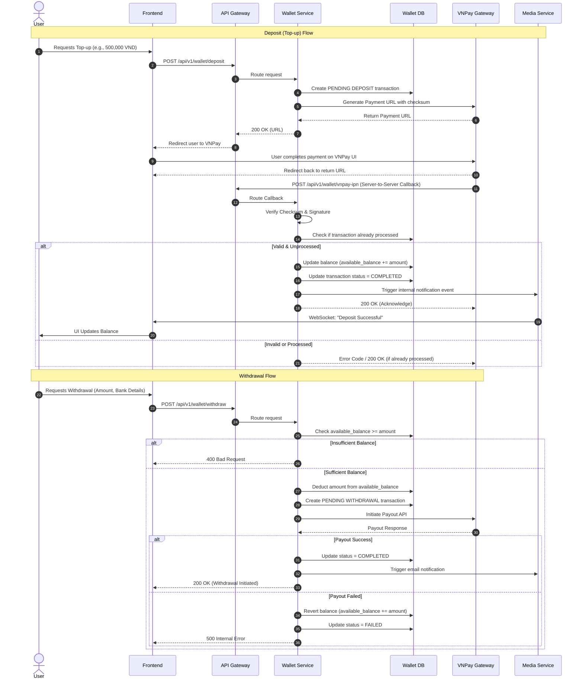

# Deposit & Withdrawal Flow (Phase 2 - VNPay Integration)

```mermaid
sequenceDiagram
    autonumber
    actor User
    participant App as Frontend
    participant GW as API Gateway
    participant WS as Wallet Service
    participant DB_WS as Wallet DB
    participant VNPay as VNPay Gateway
    participant NS as Media Service

    Note over User, NS: Deposit (Top-up) Flow
    
    User->>App: Requests Top-up (e.g., 500,000 VND)
    App->>GW: POST /api/v1/wallet/deposit
    GW->>WS: Route request
    
    WS->>DB_WS: Create PENDING DEPOSIT transaction
    WS->>VNPay: Generate Payment URL with checksum
    VNPay-->>WS: Return Payment URL
    WS-->>GW: 200 OK (URL)
    GW-->>App: Redirect user to VNPay
    
    App->>VNPay: User completes payment on VNPay UI
    VNPay-->>App: Redirect back to return URL
    
    %% IPN Callback
    VNPay->>GW: POST /api/v1/wallet/vnpay-ipn (Server-to-Server Callback)
    GW->>WS: Route Callback
    WS->>WS: Verify Checksum & Signature
    WS->>DB_WS: Check if transaction already processed
    
    alt Valid & Unprocessed
        WS->>DB_WS: Update balance (available_balance += amount)
        WS->>DB_WS: Update transaction status = COMPLETED
        WS->>NS: Trigger internal notification event
        WS-->>VNPay: 200 OK (Acknowledge)
        
        NS->>App: WebSocket: "Deposit Successful"
        App->>User: UI Updates Balance
    else Invalid or Processed
        WS-->>VNPay: Error Code / 200 OK (if already processed)
    end
    
    Note over User, VNPay: Withdrawal Flow
    
    User->>App: Requests Withdrawal (Amount, Bank Details)
    App->>GW: POST /api/v1/wallet/withdraw
    GW->>WS: Route request
    
    WS->>DB_WS: Check available_balance >= amount
    alt Insufficient Balance
        WS-->>App: 400 Bad Request
    else Sufficient Balance
        WS->>DB_WS: Deduct amount from available_balance
        WS->>DB_WS: Create PENDING WITHDRAWAL transaction
        
        %% API Call to VNPay Payout (or manual processing)
        WS->>VNPay: Initiate Payout API
        VNPay-->>WS: Payout Response
        
        alt Payout Success
            WS->>DB_WS: Update status = COMPLETED
            WS->>NS: Trigger email notification
            WS-->>App: 200 OK (Withdrawal Initiated)
        else Payout Failed
            WS->>DB_WS: Revert balance (available_balance += amount)
            WS->>DB_WS: Update status = FAILED
            WS-->>App: 500 Internal Error
        end
    end
```
