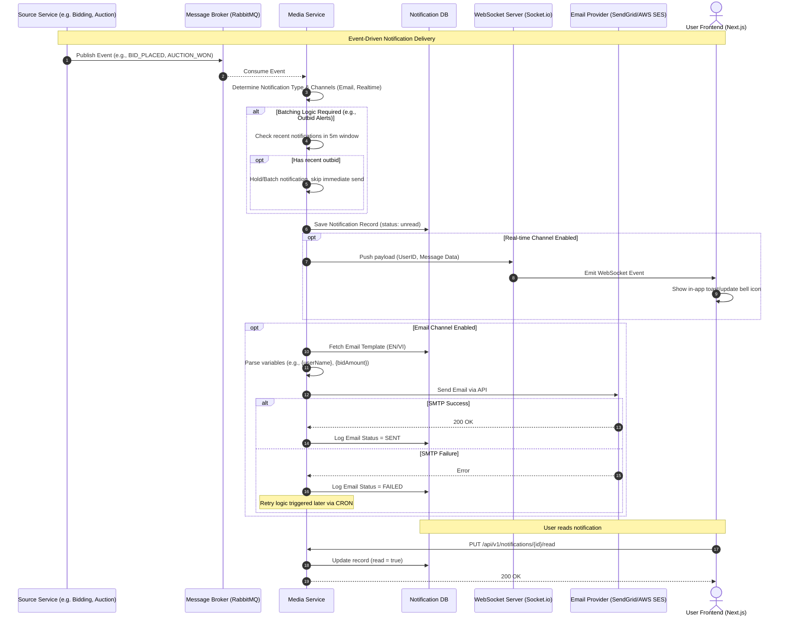

# Notification Delivery Architecture Flow

```mermaid
sequenceDiagram
    autonumber
    participant Src as Source Service (e.g. Bidding, Auction)
    participant MQ as Message Broker (RabbitMQ)
    participant NS as Media Service
    participant DB_NS as Notification DB
    participant WS_Server as WebSocket Server (Socket.io)
    participant SMTP as Email Provider (SendGrid/AWS SES)
    actor Client as User Frontend (Next.js)

    Note over Src, Client: Event-Driven Notification Delivery
    
    Src->>MQ: Publish Event (e.g., BID_PLACED, AUCTION_WON)
    MQ-->>NS: Consume Event
    
    %% Processing logic
    NS->>NS: Determine Notification Type & Channels (Email, Realtime)
    
    alt Batching Logic Required (e.g., Outbid Alerts)
        NS->>NS: Check recent notifications in 5m window
        opt Has recent outbid
            NS->>NS: Hold/Batch notification, skip immediate send
        end
    end
    
    %% Persistence
    NS->>DB_NS: Save Notification Record (status: unread)
    
    %% Real-time Delivery
    opt Real-time Channel Enabled
        NS->>WS_Server: Push payload (UserID, Message Data)
        WS_Server->>Client: Emit WebSocket Event
        Client->>Client: Show in-app toast/update bell icon
    end
    
    %% Email Delivery
    opt Email Channel Enabled
        NS->>DB_NS: Fetch Email Template (EN/VI)
        NS->>NS: Parse variables (e.g., {userName}, {bidAmount})
        NS->>SMTP: Send Email via API
        
        alt SMTP Success
            SMTP-->>NS: 200 OK
            NS->>DB_NS: Log Email Status = SENT
        else SMTP Failure
            SMTP-->>NS: Error
            NS->>DB_NS: Log Email Status = FAILED
            Note over NS: Retry logic triggered later via CRON
        end
    end
    
    %% User Interaction
    Note over Client, DB_NS: User reads notification
    Client->>NS: PUT /api/v1/notifications/{id}/read
    NS->>DB_NS: Update record (read = true)
    NS-->>Client: 200 OK
```
