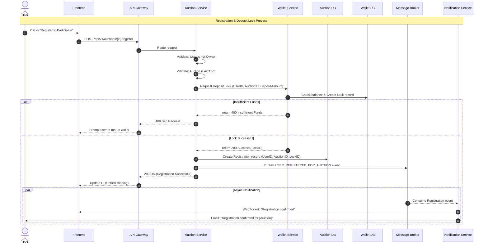

# Auction Participation Registration Flow

This flow describes the process of a user explicitly registering for an auction and paying the mandatory deposit before being allowed to place any bids.

### Key Business Rules:
1. **Mandatory Deposit:** Users cannot bid without a successful registration and locked deposit.
2. **One-time Registration:** Users only register once per auction.
3. **Refund Policy:** Deposits are automatically released if the user loses the auction (handled in Auction Closure flow).
4. **Forfeiture:** If the winner fails to pay, this locked deposit is forfeited (handled in Winner Payment flow).
